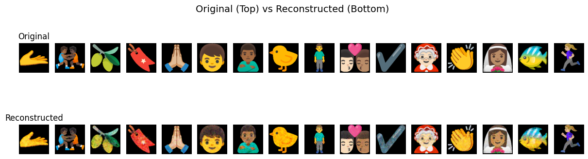

# EmoSynth

**Emoji Generator using Variational Autoencoders**

EmoSynth is an interactive web application that generates and interpolates emojis using a Variational Autoencoder (VAE) trained on emoji datasets. Explore the latent space of emojis by creating smooth interpolations between different emoji styles and generating animated GIFs.


## Features

- **Random Emoji Generation**: Discover emojis from the trained dataset
- **Latent Space Interpolation**: Create smooth transitions between emojis using VAE latent vectors
- **Multiple Interpolation Modes**: 
  - Linear interpolation (LERP)
  - Spherical linear interpolation (SLERP)
- **Nearest Neighbor Search**: Find similar emojis using k-NN in latent space
- **GIF Generation**: Export interpolations as animated GIFs with customizable frame duration
- **Frame-by-Frame Output**: Get individual frames for detailed analysis
- **Real-time Synthesis**: Fast inference with model caching and optimized processing
- **Interactive Web UI**: Modern React-based interface for easy exploration


## Architecture

EmoSynth consists of three main components:

### 1. **Model Training** (`model/`)
- Variational Autoencoder (VAE) implementation in PyTorch
- Encoder: Convolutional layers → Latent space (μ, σ)
- Decoder: Transposed convolutions → Reconstructed emoji (128×128)
- Trained on Noto emoji dataset

### 2. **Backend API** (`backend/`)
- FastAPI REST API for model inference
- Async processing with PyTorch
- Nearest neighbor search using scikit-learn
- LRU caching for emoji thumbnails and generated GIFs
- Automatic device detection (CPU/CUDA)

### 3. **Frontend** (`frontend/`)
- React + TypeScript + Vite
- Real-time emoji preview and synthesis
- Configurable interpolation parameters
- GIF playback and frame visualization

## Quick Start

### Prerequisites

- Python 3.8+
- Node.js 16+
- CUDA-capable GPU (highly recommended for training, optional for inference)
- Trained VAE model weights in `model/trained_models/` (must be trained first - see Installation step 5)
- Emoji dataset in `model/data/noto-128/` (must be downloaded - see Installation step 4)

### Installation

1. **Clone the repository**
   ```bash
   git clone https://github.com/joydeep049/EmoSynth.git
   cd EmoSynth
   ```

2. **Set up the backend**
   ```bash
   cd backend
   python -m venv .venv
   source .venv/bin/activate  # On Windows: .venv\Scripts\activate
   pip install -r requirements.txt
   ```

3. **Set up the frontend**
   ```bash
   cd ../frontend
   npm install
   ```

4. **Download the Emoji Dataset**
   
   The application requires the Noto Emoji dataset. Download it from the [Noto Emoji repository](https://github.com/googlefonts/noto-emoji/tree/main/png/128) and place it in `model/data/noto-128/`.

   **Option 1: Using Git Sparse Checkout (Recommended)**
   ```bash
   # From the project root
   mkdir -p model/data
   cd model/data
   git clone --depth 1 --filter=blob:none --sparse https://github.com/googlefonts/noto-emoji.git temp-noto
   cd temp-noto
   git sparse-checkout init --cone
   git sparse-checkout set png/128
   # Move the contents to noto-128 directory
   mkdir -p ../noto-128
   cp -r png/128/* ../noto-128/
   cd ..
   rm -rf temp-noto
   ```

   **Option 2: Direct Download**
   ```bash
   # From the project root
   mkdir -p model/data/noto-128
   cd model/data/noto-128
   # Download using wget (Linux/Mac) or curl
   # Note: You may need to download individual files or use a tool like git-lfs
   # For Windows, you can use Git Bash or download manually from:
   # https://github.com/googlefonts/noto-emoji/tree/main/png/128
   ```

   **Option 3: Manual Download**
   1. Visit [https://github.com/googlefonts/noto-emoji/tree/main/png/128](https://github.com/googlefonts/noto-emoji/tree/main/png/128)
   2. Download all PNG files from the directory
   3. Place them in `model/data/noto-128/` directory

   **Verify the dataset:**
   ```bash
   # Check that PNG files are present
   ls model/data/noto-128/*.png | wc -l  # Should show many emoji files
   ```

5. **Train the VAE Model**
   
   The application requires a trained VAE model. You need to train the model using the provided Jupyter notebooks and save it to `model/trained_models/`.
   
   ```bash
   # Navigate to the model directory
   cd model
   
   # Install additional dependencies for training (if needed)
   # You may need: jupyter, matplotlib, etc.
   pip install jupyter matplotlib
   
   # Open and run the training notebook
   jupyter notebook VAE.ipynb
   ```
   
   **Training Steps:**
   - Open `model/VAE.ipynb` in Jupyter Notebook
   - Configure training parameters (epochs, batch size, learning rate, etc.)
   - Run all cells to train the model
   - Save the trained model weights to `model/trained_models/vae_model_300.pth` (or your preferred filename)
   - Ensure the model file matches the name specified in your configuration (default: `vae_model_300.pth`)
   
   **Note:** Training can take several hours depending on your hardware and dataset size. A GPU is highly recommended for faster training.

### Running the Application

1. **Start the backend API**
   ```bash
   cd backend
   source .venv/bin/activate  # On Windows: .venv\Scripts\activate
   uvicorn app.main:app --reload --port 8000
   ```

2. **Start the frontend development server**
   ```bash
   cd frontend
   npm run dev
   ```

3. **Open your browser**
   - Navigate to `http://localhost:5173` (or the port shown by Vite)
   - The frontend will connect to the backend API at `http://localhost:8000`

## Usage

### Web Interface

1. **Get a Random Emoji**: Click the refresh button to load a random emoji from the cached dataset
2. **Configure Interpolation**:
   - **k**: Number of nearest neighbors to interpolate with (1-20)
   - **Steps Between**: Number of interpolation steps per neighbor pair (1-32)
   - **Mode**: Choose between `lerp` (linear) or `slerp` (spherical)
   - **Duration**: Frame duration in milliseconds (10-500ms)
   - **Return Type**: `gif` for animated output or `frames` for individual images
3. **Synthesize**: Click "Synthesize" to generate the interpolation
4. **View Results**: The output panel displays the generated GIF or frames

### API Endpoints

#### `GET /health`
Check API health and initialization status.

**Response:**
```json
{
  "initialized": true,
  "device": "cuda",
  "cached_count": 100,
  "model_path": "/path/to/vae_model_300.pth",
  "dataset_dir": "/path/to/noto-128"
}
```

#### `GET /random-emoji`
Get a random emoji from the cached dataset.

**Response:**
```json
{
  "id": "emoji_123",
  "thumbnail_base64": "base64_encoded_png..."
}
```

#### `POST /synthesize`
Generate an interpolation between emojis.

**Request:**
```json
{
  "id": "emoji_123",
  "k": 3,
  "steps_between": 8,
  "mode": "lerp",
  "duration_ms": 80,
  "return_type": "gif"
}
```

**Response (GIF):**
```json
{
  "gif_base64": "base64_encoded_gif...",
  "neighbor_ids": ["emoji_456", "emoji_789"],
  "frame_count": 25,
  "duration_ms": 80,
  "mode": "lerp",
  "type": "gif"
}
```

**Response (Frames):**
```json
{
  "frames": ["base64_png_1...", "base64_png_2..."],
  "neighbor_ids": ["emoji_456", "emoji_789"],
  "frame_count": 25,
  "duration_ms": 80,
  "mode": "lerp",
  "type": "frames"
}
```

## Configuration

Backend configuration can be customized via environment variables (prefixed with `EMOSYNTH_`) or a `.env` file:

```env
EMOSYNTH_DATASET_DIR=model/data/noto-128
EMOSYNTH_MODEL_PATH=model/trained_models/vae_model_300.pth
EMOSYNTH_LATENT_DIM=6
EMOSYNTH_SAMPLE_SIZE=100
EMOSYNTH_THUMBNAIL_SIZE=128
EMOSYNTH_GIF_CACHE_SIZE=32
EMOSYNTH_INTERPOLATION_MAX_FRAMES=256
EMOSYNTH_GIF_FRAME_SIZE=512
EMOSYNTH_DEVICE_PREFERENCE=auto
EMOSYNTH_RANDOM_SEED=42
```

## Project Structure

```
EmoSynth/
├── backend/                 # FastAPI backend
│   ├── app/
│   │   ├── main.py         # FastAPI application
│   │   ├── state.py        # Application state & model management
│   │   ├── cache.py        # Caching utilities
│   │   ├── interpolation.py # Interpolation algorithms
│   │   ├── config.py       # Configuration management
│   │   └── schemas.py      # Pydantic models
│   └── requirements.txt
├── frontend/               # React frontend
│   ├── src/
│   │   ├── App.tsx         # Main application component
│   │   ├── api.ts          # API client
│   │   ├── types.ts        # TypeScript types
│   │   └── components/     # React components
│   │       ├── ControlPanel.tsx
│   │       ├── FramePlayer.tsx
│   │       ├── OutputPanel.tsx
│   │       └── RandomEmojiCard.tsx
│   └── package.json
├── model/                  # VAE model and training
│   ├── skeleton.py        # VAE architecture
│   ├── VAE.ipynb          # Training notebook
│   ├── sample.ipynb       # Sampling notebook
│   ├── trained_models/    # Pre-trained weights
│   └── data/              # Training dataset
├── assets/                # Demo GIFs and images
└── README.md
```

## Model Details

The VAE architecture:

- **Encoder**: 
  - Conv2d layers (3→32→64 channels)
  - MaxPool2d for downsampling
  - Fully connected layers → latent space (μ, log σ²)

- **Decoder**:
  - Fully connected layers
  - ConvTranspose2d layers for upsampling
  - Output: 3-channel RGB image (128×128)

- **Latent Dimension**: 6 (configurable)
- **Input/Output Size**: 128×128 pixels

## Training Details

This Model was trained on 1 Nvidia RTX 4000 GPU for 300 epochs. Each epoch took about 8 seconds to finish. Several techniques like decoder freeze and KL annealing were used for faster convergence. Furthermore, the loss function was enhanced with L2 regularisation and Pairwise-Distance regulariser, which is a convex regularisation technique.

### Latent Space Visualization

The trained VAE learns a meaningful latent representation of emojis. Below is a visualization of the latent space after training:


### Original vs Reconstructed Images

The model's ability to reconstruct emojis from the latent space is shown below. The left images are original emojis from the dataset, and the right images are the model's reconstructions:



The model demonstrates good reconstruction quality, capturing the essential features and style of the emojis while learning a compact 6-dimensional latent representation.  

## Interpolation Modes

### Linear Interpolation (LERP)
Simple linear interpolation between two latent vectors:
```
z(t) = (1 - t) * z₀ + t * z₁
```

### Spherical Linear Interpolation (SLERP)
Interpolation along the surface of a hypersphere, preserving angular velocity:
```
z(t) = sin((1-t)Ω) / sin(Ω) * z₀ + sin(tΩ) / sin(Ω) * z₁
```

SLERP often produces smoother transitions in latent space.

## Development

### Training a New Model

Before running the application, you must train the VAE model. Follow these steps:

1. **Prepare your emoji dataset** in `model/data/noto-128/` (see Installation step 4)

2. **Set up training environment:**
   ```bash
   cd model
   # Install training dependencies
   pip install jupyter matplotlib torch torchvision
   ```

3. **Train the model:**
   - Open `VAE.ipynb` in Jupyter Notebook
   - Configure training parameters:
     - Number of epochs
     - Batch size
     - Learning rate
     - Latent dimension (default: 6)
   - Run all cells to train the model
   - The notebook will save checkpoints during training

4. **Save the trained model:**
   - Save the final model weights to `model/trained_models/vae_model_300.pth`
   - You can use a different filename, but make sure to update the `EMOSYNTH_MODEL_PATH` configuration accordingly
   - The model file should contain the PyTorch state dictionary

5. **Verify the model:**
   - Use `sample.ipynb` to test the trained model and visualize results
   - Ensure the model can encode and decode emojis correctly

**Training Tips:**
- Use a GPU for significantly faster training (CUDA)
- Monitor loss values to ensure the model is learning
- Adjust hyperparameters if the model is not converging
- Save checkpoints regularly to avoid losing progress

### Building for Production

**Frontend:**
```bash
cd frontend
npm run build
```

**Backend:**
```bash
cd backend
uvicorn app.main:app --host 0.0.0.0 --port 8000
```

## License

This project is licensed under the GPL License - see the LICENSE file for details.

## Acknowledgments

- [Noto Emoji](https://github.com/googlefonts/noto-emoji) dataset by Google Fonts for training data
- PyTorch and FastAPI communities
- All contributors and users

---

**Note**: 
- The model weights are **not included** in the repository due to size constraints
- You **must train the model** yourself using the provided `VAE.ipynb` notebook before running the application
- Save the trained model to `model/trained_models/vae_model_300.pth` (or update the configuration to match your filename)
- Make sure you have downloaded the emoji dataset to `model/data/noto-128/` before training
